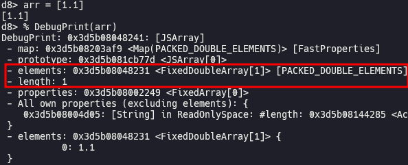
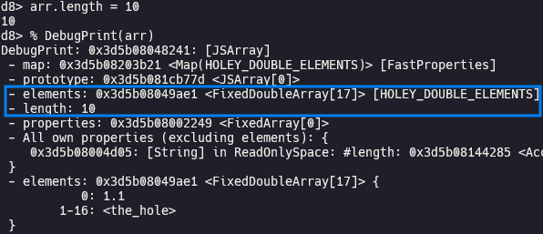
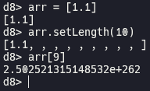
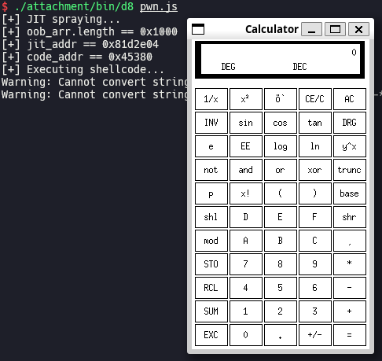

# [DiceCTF 2022 / Pwn] memory hole

> literally 1984.
>
> note: you should read the design doc of The Cage and its code; try to understand how it works, since it'll be hard to solve this challenge by just jit monkeying.
>
> [Challenge](https://github.com/dicegang/dicectf-2022-challenges/tree/master/pwn/memory-hole) [CTFtime](https://ctftime.org/task/18826) [Attachment](./attachment)

## Setup

- Ubuntu 20.04.6 LTS (WSL)
- [refs/tags/9.9.105](https://chromium.googlesource.com/v8/v8/+/refs/tags/9.9.105) (Jan 16th, 2022)

Save [`attachment`](./attachment), [`dcheck.diff`](./dcheck.diff) and [`setup.zsh`](./setup.zsh) in your working directory and run `setup.zsh`.

## Analysis

### Out of bounds caused by setLength() method

[`patch.patch`](./attachment/bin/patch.patch) adds [`setLength()`](./attachment/bin/patch.patch#L122) method which sets length of an array to arbitrary value to `Array` object.

Without new `setLength()` method, we can set length of an array like following:

In this case, extended array for elements of `arr` is newly allocated because OOB occurs otherwise. This is handled by [`Subclass::GrowCapacityAndConvertImpl()`](https://source.chromium.org/chromium/v8/v8/+/refs/tags/9.9.105:src/objects/elements.cc;l=888) which is [called](https://source.chromium.org/chromium/v8/v8/+/refs/tags/9.9.105:src/objects/elements.cc;l=770) in [`Subclass::SetLengthImpl()`](https://source.chromium.org/chromium/v8/v8/+/refs/tags/9.9.105:src/objects/elements.cc;l=722).

However, [`ArrayPrototypeSetLength()`](./attachment/bin/patch.patch#L44) doesn't care about the possibility of OOB. It just set [`length`](https://source.chromium.org/chromium/v8/v8/+/refs/tags/9.9.105:src/objects/js-array.tq;l=56) of `array` to new `len`, without allocating new [`elements`](https://source.chromium.org/chromium/v8/v8/+/refs/tags/9.9.105:src/objects/js-objects.tq;l=33). As a result, we can access out of bounds of an array after we increase its length using `setLength()` method.

## Exploitation

### Implement exploitation primitives

We can implement [`addrof`](./pwn.js#L68) primitive by defining `oob_arr` and `obj_arr` consecutively in a function and accessing to `obj_arr` using OOB. Then we can get the address of object in `obj_arr[0]` as a float number. We can also implement sandboxed [AAR](./pwn.js#L74)/[AAW](./pwn.js#L80) primitives by defining `oob_arr` and `typed_arr` consecutively and overwriting `data_ptr` of `typed_arr` using OOB.

### Escape V8 sandbox to get RCE

> [Escaping V8 Sandbox via Turbofan JIT Spraying: Part 1 (Chromium < 100.0.4896.60)](https://aaronsjcho.github.io/Escaping-V8-Sandbox-via-Turbofan-JIT-Spraying-Part-1/)

You have to install `/bin/xcalc` via `sudo apt install -y x11-apps` before running `pwn.js` if you are using WSL.

