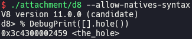
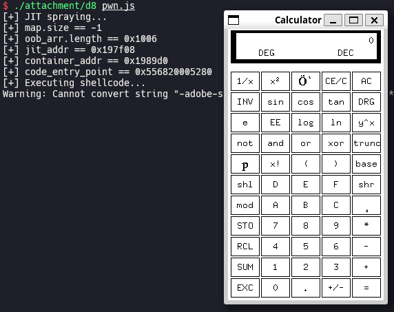

# [HITCON CTF 2022 / Pwn] Fourchain - Hole

> There's a hole in the program ?
>
> Well I'm sure it's not that of a big deal, after all it's just a small hole that won't do any damage right ?
>
> ... Right 😨 ?
>
> [Challange](https://ctf2022.hitcon.org/dashboard/#14) [CTFtime](https://ctftime.org/task/23943) [Attachment](./attachment)

## Setup

- Ubuntu 22.04.5 LTS (WSL)
- [63cb7fb817e60e5633fb622baf18c59da7a0a682](https://chromium.googlesource.com/v8/v8/+/63cb7fb817e60e5633fb622baf18c59da7a0a682) (Nov 17th, 2022)

Save [`attachment`](./attachment), [`dcheck.diff`](./dcheck.diff) and [`setup.zsh`](./setup.zsh) in your working directory and run `setup.zsh`.

## Analysis

[`add_hole.patch`](./attachment/add_hole.patch) adds [`hole()`](./attachment/add_hole.patch#L64) method to `Array` object. It is implemented as [`BUILTIN(ArrayHole)`](./attachment/add_hole.patch#L9). If `args.length()` is not more than 1, which means that no argument is passed to `hole()` method, it returns `ReadOnlyRoots(isolate).the_hole_value()`, which is `the_hole` object in JavaScript.

## Exploitation

`add_hole.patch` [removes](./attachment/add_hole.patch#L26) the patch for the exploitation technique explained in [Exploiting V8 Hole via Corrupting Map Object (Chromium < 103.0.5060.53)](https://aaronsjcho.github.io/Exploiting-V8-Hole-via-Corrupting-Map-Object/), so we can just use it and get RCE.

You have to install `/bin/xcalc` by running `sudo apt install -y x11-apps` before executing [`pwn.js`](./pwn.js) if you are using WSL.

