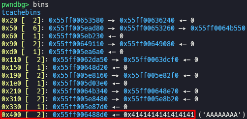

# [RITSEC CTF 2021 / Pwn] Baby WASM

> [Challenge](https://gitlab.ritsec.cloud/competitions/ctf-2021/-/tree/master/pwn/babywasm) [CTFtime](https://ctftime.org/task/15542) [Attachment](./attachment)

## Setup

- Ubuntu 20.04.6 LTS
- [0d81cd72688512abcbe1601015baee390c484a6a](https://chromium.googlesource.com/v8/v8/+/0d81cd72688512abcbe1601015baee390c484a6a) (Sep 29th, 2020)

Place [`attachment`](./attachment) and [`setup.zsh`](./setup.zsh) in your working directory and run `setup.zsh`.

## Analysis

### WebAssembly.Memory

[`WebAssembly.Memory`](https://developer.mozilla.org/docs/WebAssembly/Reference/JavaScript_interface/Memory) object contains an [`array_buffer`](https://source.chromium.org/chromium/v8/v8/+/0d81cd72688512abcbe1601015baee390c484a6a:src/wasm/wasm-objects.h;l=294) which is accessible from both of JavaScript and WebAssembly.

Constructor of `WebAssembly.Memory` gets an object as argument. This object must have `initial` property which is the initial size of `ArrayBuffer`, and optionally has `maximum` property which is the maximum size of `ArrayBuffer`. Unit of the size is page, and each page contains [`kWasmPageSize`](https://source.chromium.org/chromium/v8/v8/+/0d81cd72688512abcbe1601015baee390c484a6a:src/wasm/wasm-constants.h;l=114) bytes.

`WebAssembly.Memory` object has [`grow`](https://source.chromium.org/chromium/v8/v8/+/0d81cd72688512abcbe1601015baee390c484a6a:src/wasm/wasm-js.cc;l=2196) method which extends the size of `array_buffer` by pages. This method is handled by [`WebAssemblyMemoryGrow()`](https://source.chromium.org/chromium/v8/v8/+/0d81cd72688512abcbe1601015baee390c484a6a:src/wasm/wasm-js.cc;l=1718).

### v8.diff

[`v8.diff`](./attachment/v8.diff) adds a new [`shrink`](./attachment/v8.diff#L245) method which reduces the size of `array_buffer` by bytes. This new method is handled by [`WebAssemblyMemoryShrink()`](./attachment/v8.diff#L215). `WebAssemblyMemoryShrink()` calls [`WasmMemoryObject::Shrink()`](./attachment/v8.diff#L258), which calls [`BackingStore::CopyWasmMemoryOnShrink()`](./attachment/v8.diff#L52) to allocate [`new_backing_store`](./attachment/v8.diff#L288) and replace `array_buffer` of `memory_object` with [`new_buffer`](./attachment/v8.diff#L298) whose backing store is `new_backing_store`.

### Use after free

We can access to old backing store which is a freed chunk, by saving `mem.buffer` to another variable before we call `shrink()`.

## Exploitation

### Get libc base

We can get base address of libc by leaking the address of `main_arena` which is stored in forward pointer (or backward pointer) of freed chunk not in tcache.

### Tcache dup

We can get a fake chunk at arbitrary address by overwriting forward pointer of freed chunk in tcache.

### Get shell

We can execute arbitrary command by overwriting `__free_hook` with the address of `system()` and freeing a chunk in which shell command to execute is stored.

[`pwn.js`](./pwn.js)

